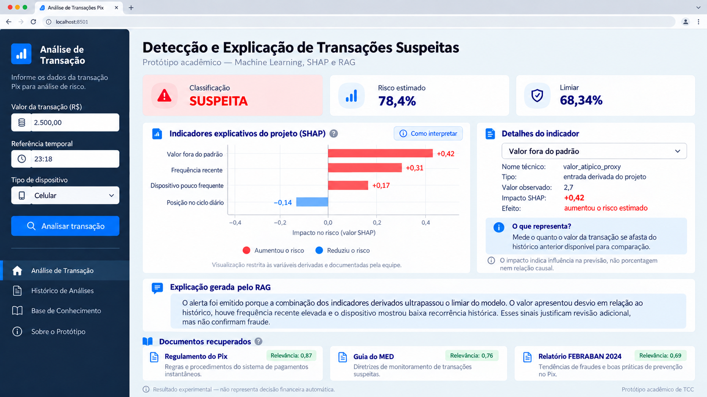

# Dashboard de detecção e explicação

## Objetivo

O dashboard Streamlit demonstra o fluxo completo do protótipo sem duplicar regras de Machine Learning, SHAP ou RAG. A interface recebe uma transação completa, chama `src.pipeline.explicar_transacao` e apresenta a resposta validada pelo contrato de `app.py`.



Os valores do mockup são ilustrativos. A aplicação utiliza os valores retornados pelo pipeline em cada execução.

O desenho separa dois níveis de leitura:

- **leitura executiva:** classificação, risco estimado, limiar e explicação em português;
- **leitura técnica:** valores das features, contribuições SHAP, limitações semânticas, documentos recuperados e configuração da execução.

## Fluxo da análise

```text
Transação completa
        ↓
Pipeline existente
        ↓
XGBoost → probabilidade e classificação
        ↓
SHAP → contribuição de cada fator
        ↓
FAISS/RAG → trechos regulatórios relevantes
        ↓
LLM → explicação em português
        ↓
Dashboard → resultado, fatores, fontes e limitações
```

## Componentes da interface

### Entrada da transação

A demonstração prioriza transações completas exportadas do conjunto de teste. O usuário também pode informar JSON, desde que contenha a estrutura esperada pelo pré-processador. Um formulário simplificado não é utilizado porque o modelo depende de centenas de atributos; preencher automaticamente os campos restantes criaria uma entrada artificial.

### Cartões de resultado

Os três cartões respondem perguntas diferentes:

- **Classificação:** informa se o limiar foi ultrapassado;
- **Risco estimado:** mostra a probabilidade devolvida pelo modelo;
- **Limiar:** registra o ponto de corte usado para emitir o alerta.

A classificação é um sinal para revisão e não uma confirmação de fraude.

### Painel SHAP das variáveis do projeto

O gráfico apresenta exclusivamente as contribuições das quatro proxies criadas e documentadas pela equipe: `valor_atipico_proxy`, `frequencia_recente_proxy`, `dispositivo_raro_proxy` e `posicao_ciclo_diario_relativa`. Barras vermelhas aumentaram a saída do modelo e barras azuis a reduziram. O comprimento é relativo ao maior impacto exibido naquele caso e não deve ser usado para comparar escalas entre transações diferentes.

O classificador continua utilizando a matriz completa produzida pelo pré-processador. A restrição é aplicada somente à camada de explicação — SHAP exibido, consulta RAG e contexto do LLM — para impedir que variáveis anonimizadas recebam interpretações inventadas. Portanto, o painel descreve os **indicadores explicáveis do projeto**, e não afirma que eles são necessariamente as quatro maiores contribuições entre todas as features do XGBoost.

O seletor **Detalhes do indicador** apresenta:

- tipo da variável;
- valor observado na entrada transformada;
- contribuição SHAP;
- direção do efeito;
- descrição disponível;
- limitação de interpretação.

O catálogo de descrições é determinístico e fica em `src/ui/components.py`. Qualquer fator fora da lista permitida é omitido da visualização como defesa adicional. `isFraud` é o alvo usado na avaliação e nunca é tratado como entrada. `TransactionDT` é usado para ordenação e divisão temporal, não entra no modelo e não é apresentado como horário civil.

O impacto SHAP não representa aumento percentual de fraude e não demonstra causalidade, intenção ou culpa.

### Explicação em português

Quando o cliente de LLM está configurado, o dashboard apresenta a explicação gerada a partir dos fatores SHAP e dos documentos recuperados. O texto deve permanecer condicionado às evidências fornecidas pelo pipeline.

Quando o LLM falha ou não está configurado, a tela não cria uma explicação substituta. A classificação, a probabilidade, os fatores e as evidências continuam disponíveis, acompanhados de um aviso explícito.

### Evidências RAG

Cada documento recuperado apresenta título, trecho, origem e pontuação de similaridade quando esses campos estão disponíveis. A ausência do índice vetorial é mostrada como estado de indisponibilidade, não como recuperação vazia bem-sucedida.

## Estados de erro tratados

- JSON vazio, inválido, excessivamente grande ou que não seja um objeto;
- módulo ou função do pipeline não configurados;
- artefato do modelo ausente;
- índice RAG indisponível;
- cliente LLM sem credencial ou com falha externa;
- resposta do pipeline fora do contrato esperado;
- falha inesperada, registrada em log sem expor dados sensíveis na interface.

## Execução

```powershell
$env:ANTHROPIC_API_KEY = "sua-chave-local"
$env:TCC_PIPELINE_MODULE = "src.pipeline"
$env:TCC_PIPELINE_FUNCTION = "explicar_transacao"
.\.venv\Scripts\python.exe -m streamlit run app.py
```

A chave deve permanecer apenas no ambiente local. Sem ela, o dashboard continua exibindo as etapas determinísticas e sinaliza que a explicação do LLM está indisponível.
