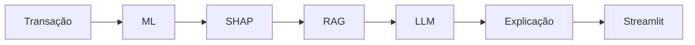

# Figura da arquitetura

**Título:** Figura `{{PREENCHER}}` — Fluxo integrado para classificação e explicação de transações suspeitas.

**Legenda:** A transação é processada pelo modelo de aprendizado de máquina, que produz a predição de risco. O SHAP identifica os fatores que influenciaram essa saída. O RAG recupera os documentos pertinentes e fornece, junto às evidências do modelo, o contexto para o LLM gerar uma explicação em português. A interface Streamlit apresenta a predição, os fatores SHAP, a explicação e as fontes recuperadas. Fonte: elaboração própria.
